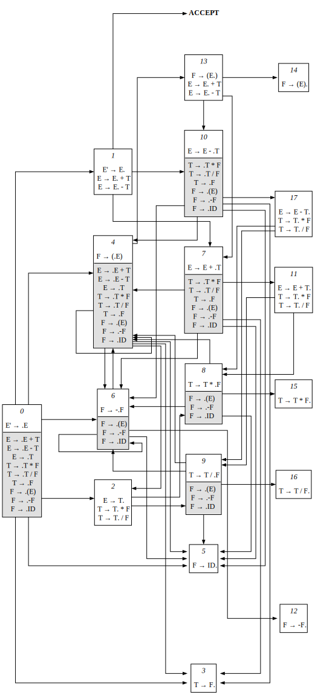

# SLR Parser

Это реализация синтаксического анализатора (парсера) для простейшего арифметического языка, построенная на базе алгоритма SLR(1). Проект включает в себя лексический анализатор на основе Flex.

## Описание грамматики
Ниже приведен полный список правил используемой грамматики. Правило 0 является дополненной грамматикой для работы алгоритма SLR.

0. $$E' \rightarrow E$$
1. $$E \rightarrow E + T$$
2. $$E \rightarrow E - T$$
3. $$E \rightarrow T$$
4. $$T \rightarrow T * F$$
5. $$T \rightarrow T / F$$
6. $$T \rightarrow F$$
7. $$F \rightarrow (E)$$
8. $$F \rightarrow \mathbf{id}$$
9. $$F \rightarrow -F$$

* **Терминалы**: `id`, `+`, `-`, `*`, `/`, `(`, `)`, `$` (конец строки).
* **Нетерминалы**: `E` (Expression), `T` (Term), `F` (Factor).


## Детерминированный конечный автомат LR(0)
Для управления разбором используется ДКА, построенный на основе множества **LR(0)-пунктов**. Каждый пункт вида $A \rightarrow \alpha \cdot \beta$ отслеживает текущую позицию разбора.


Автомат переходит между состояниями при получении нового токена от лексера или при выполнении свертки.




## Описание SLR(1) и таблицы
Алгоритм **SLR (Simple LR)** использует множества **FOLLOW** для разрешения конфликтов "перенос-свертка". Свертка по правилу $A \rightarrow \alpha$ выполняется только в том случае, если следующий символ принадлежит $FOLLOW(A)$.

`FOLLOW(E) = {+, -, ), $}`
<br>
`FOLLOW(T) = {+, -, *, /, ) $}`
<br>
`FOLLOW(F) = {+, -, *, /, ), $}`

### Таблица парсинга
Таблица разделена на две части:
1. **ACTION**: Действия по терминалам (Shift $n$, Reduce $k$, Accept).
2. **GOTO**: Переходы по нетерминалам после выполнения свертки.


| State | id | + | - | * | / | ( | ) | $ | E | T | F |
| :---: | :---: | :---: | :---: | :---: | :---: | :---: | :---: | :---: | :---: | :---: | :---: |
| **0** | s5 | | s6 | | | s4 | | | 1 | 2 | 3 |
| **1** | | s7 | s10 | | | | | **ACC** | | | |
| **2** | | r3 | r3 | s8 | s9 | | r3 | r3 | | | |
| **3** | | r6 | r6 | r6 | r6 | | r6 | r6 | | | |
| **4** | s5 | | s6 | | | s4 | | | 13 | 2 | 3 |
| **5** | | r8 | r8 | r8 | r8 | | r8 | r8 | | | |
| **6** | s5 | | s6 | | | s4 | | | | | 12 |
| **7** | s5 | | s6 | | | s4 | | | | 11 | 3 |
| **8** | s5 | | s6 | | | s4 | | | | | 15 |
| **9** | s5 | | s6 | | | s4 | | | | | 16 |
| **10** | s5 | | s6 | | | s4 | | | | 17 | 3 |
| **11** | | r1 | r1 | s8 | s9 | | r1 | r1 | | | |
| **12** | | r9 | r9 | r9 | r9 | | r9 | r9 | | | |
| **13** | | s7 | s10 | | | | s14 | | | | |
| **14** | | r7 | r7 | r7 | r7 | | r7 | r7 | | | |
| **15** | | r4 | r4 | r4 | r4 | | r4 | r4 | | | |
| **16** | | r5 | r5 | r5 | r5 | | r5 | r5 | | | |
| **17** | | r2 | r2 | s8 | s9 | | r2 | r2 | | | |

**Обозначения:**
* Shift (sN) - перенос токена в стек и переход в состояние N.
* Reduce (rK) - свертка по правилу грамматики K.
* ACC (Accept) - успешное завершение анализа.
* Пустое место означает синтаксическую ошибку.

## Ввод и вывод

### Ввод

На вход подается строка
```bash
a + b
```
### Вывод

На выходе получаем файл OutputTable.txt с таблицей:
| STACK | INPUT | ACTION |
| :--- | :--- | :--- |
| 0 | a+b$ | Shift 5 |
| 0 5 | +b$ | Reduce 8 |
| 0 3 | +b$ | Reduce 6 |
| 0 2 | +b$ | Reduce 3 |
| 0 1 | +b$ | Shift 7 |
| 0 1 7 | b$ | Shift 5 |
| 0 1 7 5 | $ | Reduce 8 |
| 0 1 7 3 | $ | Reduce 6 |
| 0 1 7 11 | $ | Reduce 1 |
| 0 1 | $ | Accept |


## Сборка и запуск

### Предварительные требования

* **CMake**
* **Flex** (Lexical analyzer generator)
* **G++**
* **Google Test** (`libgtest-dev`)

### Сборка

```bash
git clone https://github.com/whateve3r/SLRParser.git
cd SLRParser
cmake -B build -S . 
cmake --build build
```

### Запуск

```bash
cd build/
./SLR
```

### Тесты

```bash
cd build/
./tests/run_tests